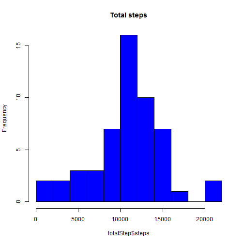
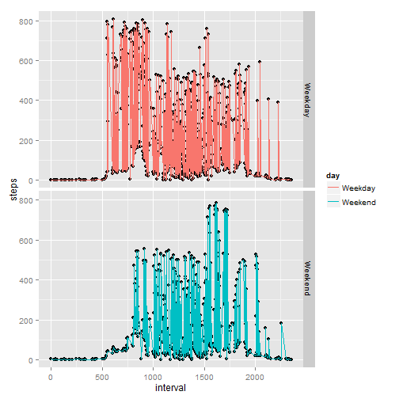

#Load and preprocess the data

###Set working directory to location of activity.csv file and load raw data


```r
  setwd("~/Studie/DataScience/Reproducible research")
  rawData<- read.csv("./activity.csv", header=T)
```

###process the raw data

```r
  rawData$steps<-as.numeric(rawData$steps)
  rawData$date<- as.Date(rawData$date)
  rawData$interval<- as.numeric(rawData$interval)
```

#What is mean total number of steps taken per day?

###Aggregate the data to find the # steps taken each day


```r
  totalStep <- aggregate(steps~date,rawData, na.rm= TRUE,sum)
```

###Draw a histogram to view the data distribution


```r
  hist(totalStep$steps,col="blue",breaks=10,main="Total steps")
```

 

###Now we can calculate the mean steps per day


```r
  meanTotalStep<-mean(totalStep$steps, na.rm=TRUE)
  meanTotalStep
```

```
## [1] 10766.19
```

###and calculate the median steps per day

```r
  medianTotalStep <- median(totalStep$steps, na.rm=TRUE)
  medianTotalStep 
```

```
## [1] 10765
```

#What is the average daily activity pattern?

###1. Make a time series plot (i.e. type = "l") of the 5-minute interval (x-axis) and the average number of steps taken, averaged across all days (y-axis)


```r
  avgActiviy <- aggregate(steps~interval,rawData, na.rm=TRUE,mean)
```

### Use the Lattice plotting system to show a scatterplot of the data


```r
  library(lattice)
  xyplot(avgActiviy$steps~avgActiviy$interval,type = "l",
         xlab="Interval",
         ylab="Number of steps",
         main="Time series: Activity all days")
```

 

###2. Which 5-minute interval, on average across all the days in the dataset, contains the maximum number of steps?


```r
  minInterval<-subset(avgActiviy,steps==max(steps))$interval
  minInterval
```

```
## [1] 835
```

#Imputing missing values

###Note that there are a number of days/intervals where there are missing values (coded as NA). The presence of missing days may introduce bias into some calculations or summaries of the data.

###1. Calculate and report the total number of missing values in the dataset (i.e. the total number of rows with NAs)

### For this we create a dataframe with only missing values (NAs)

```r
  missingValues<-rawData[is.na(rawData$steps),]
  dim(missingValues)
```

```
## [1] 2304    3
```

```r
  head(missingValues)
```

```
##   steps       date interval
## 1    NA 2012-10-01        0
## 2    NA 2012-10-01        5
## 3    NA 2012-10-01       10
## 4    NA 2012-10-01       15
## 5    NA 2012-10-01       20
## 6    NA 2012-10-01       25
```

###2. Devise a strategy for filling in all of the missing values in the dataset. The strategy does not need to be sophisticated. For example, you could use the mean/median for that day, or the mean for that 5-minute interval, etc.

### Using the average steps per interval for filling the NAs.


```r
  for(i in 1:nrow(avgActiviy)){
        AggInter <- avgActiviy[i,1]   
        AggSteps <-   avgActiviy[i,2] 
        
        indexList<- grep(paste0("^",AggInter,"$"),rawData$interval)
        
        for (a in 1: length(indexList)){
              index<-indexList[a]
              if(is.na(rawData[index,1])){
                    AggSteps -> rawData[index,1]     
              }
        }
  }
```

###3. Create a new dataset that is equal to the original dataset but with the missing data filled in.

###Assign original dataset with NAs filled in (rawData) to new data frame FilledData


```r
  filledData<-rawData
```

### Restore the rawData dataset by reloading its original content


```r
  rawData<- read.csv("./activity.csv", header=T)
```

###4. Make a histogram of the total number of steps taken each day and Calculate and report the mean and median total number of steps taken per day. Do these values differ from the estimates from the first part of the assignment? What is the impact of imputing missing data on the estimates of the total daily number of steps?

### Create data frame with agregated data: find the total number of steps taken each day with the help of the aggregate() function.


```r
  totalPerDay<- aggregate(steps~date,filledData, na.rm= TRUE,sum)
  head(totalPerDay)  
```

```
##         date    steps
## 1 2012-10-01 10766.19
## 2 2012-10-02   126.00
## 3 2012-10-03 11352.00
## 4 2012-10-04 12116.00
## 5 2012-10-05 13294.00
## 6 2012-10-06 15420.00
```

### draw the histogram, to view the data distribution


```r
  hist(totalPerDay$steps,col="orange",breaks=10,main="Average Total")
```

 

### recalculate the mean including the filled NAs

```r
  meanPerDay<-mean(totalPerDay$steps, na.rm=TRUE)
  meanPerDay
```

```
## [1] 10766.19
```

### recalculate the median including the filled NAs

```r
  medianPerDay<-median(totalPerDay$steps, na.rm=TRUE)
  medianPerDay
```

```
## [1] 10766.19
```

###The mean and the median are now equal. In fact they both have the same value as the median of the rawData that we calculated earlier(10766.19)
###Only the median of the rawData without NAs had a different value( 10765).

#Are there differences in activity patterns between weekdays and weekends?

###For this part the weekdays() function may be of some help here. Use the dataset with the filled-in missing values for this part.

###1. Create a new factor variable in the dataset with two levels - "weekday" and "weekend" indicating whether a given date is a weekday or weekend day.

### Split up days starting with 's' AS weekend other days AS weekday


```r
  filledData$date<-format(as.POSIXlt(filledData$date),"%a %b %Y")
  
  for (i in 1: nrow(filledData)){   
        day<-grep("^S",filledData[i,2])
        if(length(day)!=0){           
              "Weekend"->filledData[i,4]   
        }else{
              "Weekday"->filledData[i,4] 
        }                   
  }  
```

### Name new factor variable column containing "weekday" and "weekend" --> day 

```r
  names(filledData)[4]<-"day"
```

### Subseting the data; the "avgActivity2" data frame contains the average number of steps, averaged across all weekday days and weekend days


```r
  avgActivity2 <- aggregate(interval~steps+ day,filledData, na.rm=TRUE,mean)
  head(avgActivity2)
```

```
##       steps     day   interval
## 1 0.0000000 Weekday 1122.02314
## 2 0.0754717 Weekday  182.50000
## 3 0.1132075 Weekday 2245.00000
## 4 0.1320755 Weekday   96.66667
## 5 0.1509434 Weekday   62.50000
## 6 0.1698113 Weekday  137.50000
```

###2. Make a panel plot containing a time series plot (i.e. type = "l") of the 5-minute interval (x-axis) and the average number of steps taken, averaged across all weekday days or weekend days (y-axis). See the README file in the GitHub repository to see an example of what this plot should look like using simulated data.

###Generate and show the panel plot

```r
  library(ggplot2)
  p<-qplot(interval,steps,data=avgActivity2,facets=day~.)
  p + geom_line(aes(color = day))  
```

 

